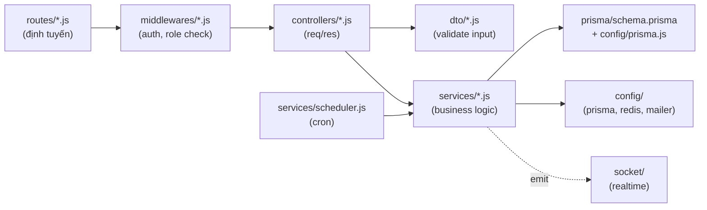
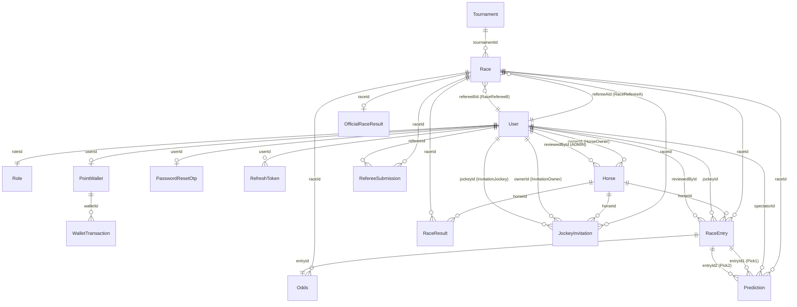

# Cursor Context Memory — Backend

> Bộ nhớ ngữ cảnh chi tiết cho phần **Backend** của dự án `Horse Racing Prediction`.
> Đọc kèm file [`cursor.md`](../cursor.md) ở thư mục gốc để nắm kiến trúc tổng thể.

---

## 1. Tech stack BE

| Lớp | Công nghệ | Phiên bản | Bằng chứng |
|---|---|---|---|
| Runtime | Node.js (Docker base `node:22-bookworm-slim`) | Node 22 | `backend/Dockerfile` |
| Framework | Express | `^4.16.1` | `backend/package.json` |
| ORM | Prisma + `@prisma/adapter-pg` (driver adapter cho Prisma 7) | `^7.8.0` | `backend/src/config/prisma.js`, `backend/package.json` |
| Database | PostgreSQL (Supabase hoặc container local) | — | `backend/prisma/schema.prisma`, `docker-compose.yml` |
| Cache / token store | Redis (`redis` package) | `^5.12.1` | `backend/src/config/redis.js` |
| Realtime | Socket.IO (namespace `/notifications`) | `^4.8.3` | `backend/src/socket/index.js` |
| Cron | `node-cron` | `^4.2.1` | `backend/src/services/scheduler.js` |
| Mail | `nodemailer` (SMTP Gmail) | `^8.0.8` | `backend/src/config/mailer.js` |
| Bcrypt | `bcrypt` | `^6.0.0` | `backend/src/services/auth.js` |
| JWT | `jsonwebtoken` | `^9.0.3` | `backend/src/middlewares/auth.js`, `services/auth.js` |
| API doc | `swagger-ui-express` tại `/api-docs` | `^5.0.1` | `backend/app.js`, `backend/src/openapi.js` |
| Test | Jest `^30.4.2` + supertest `^7.1.4` + tsx `^4.22.3` | — | `backend/jest.config.js`, `backend/package.json` |
| CommonJS | `require` / `module.exports` | — | `backend/app.js` |

---

## 2. Mô hình kiến trúc

**Layered + Service-Controller-Route** theo kiểu Express generator:



- **Controller**: parse `req`, gọi DTO validate, gọi Service, trả response.
- **Service**: chứa toàn bộ nghiệp vụ, gọi Prisma, throw error thuần (string) → controller xử lý status.
- **DTO**: hàm validate đầu vào (đơn giản, không dùng thư viện). Throw error → 400.
- **Middleware**: `auth.js` (verify JWT + Redis check), `adminOnly.js`, `spectatorOnly.js`, `horseOwnerOnly.js`.
- **Không có DI container** — các service được `require` trực tiếp, một số chỗ dùng class instance singleton (`module.exports = new XService()`), một số chỗ export object literal (`module.exports = { X }`).

---

## 3. Cấu trúc thư mục BE

```
backend/
├── app.js                          # Khai báo Express + đăng ký router + Swagger
├── bin/
│   └── www                         # HTTP server + Socket.IO + cron (entry point thật)
├── prisma/
│   ├── schema.prisma               # Định nghĩa model + enum + generator
│   ├── seed.js                     # Seed Roles + 2 user dev
│   ├── prisma.config.ts            # Cấu hình Prisma (dùng DIRECT_URL cho migrate)
│   └── migrations/                 # Lịch sử migration (timestamp prefix)
├── src/
│   ├── config/
│   │   ├── prisma.js               # Singleton PrismaClient (driver pg)
│   │   ├── redis.js                # Singleton redisClient (tự connect khi require)
│   │   └── mailer.js               # nodemailer transporter
│   ├── middlewares/
│   │   ├── auth.js                 # Verify JWT + kiểm tra token còn trong Redis
│   │   ├── adminOnly.js
│   │   ├── spectatorOnly.js
│   │   └── horseOwnerOnly.js
│   ├── routes/
│   │   ├── index.js                # /
│   │   ├── users.js                # /users
│   │   ├── auth.js                 # /api/auth (register, login, refresh, logout, forgot/reset password, profile)
│   │   ├── tournaments.js          # /api/tournaments (public)
│   │   ├── horses.js               # /api/horses (public + horse owner)
│   │   ├── races.js                # /api/races (public: open, detail, ...)
│   │   ├── raceEntries.js          # /api/entries, /api/races/:raceId/entries
│   │   ├── owner/
│   │   │   └── entries.js          # /api/owner/entries (mounted riêng để né collision)
│   │   ├── invitations.js          # /api/invitations
│   │   ├── predictions.js          # /api/predictions (place/cancel/list)
│   │   ├── wallet.js               # /api/wallet
│   │   ├── referee.js              # /api/referee và /api/referees
│   │   └── admin/
│   │       ├── users.js
│   │       ├── tournaments.js
│   │       ├── horses.js
│   │       ├── races.js
│   │       ├── settlement.js       # Publish / Unpublish dùng chung mount /api/admin/races
│   │       └── wallets.js
│   ├── controllers/                # Một controller cho mỗi nhóm route
│   ├── services/                   # Business logic, transaction Prisma
│   ├── dto/                        # Validate input (đơn giản, throw Error)
│   ├── socket/
│   │   ├── index.js                # initSocket, getIO, getNotificationNsp
│   │   └── emitter.js              # emitToUser / emitToAdmin / emitToRace / emitToAll
│   └── openapi.js                  # OpenAPI 3.0 spec cho Swagger UI
├── tests/                          # Jest tests (hiện rất ít file)
├── views/                          # View engine Jade (mặc định Express generator, không dùng cho API)
├── public/                         # Static files
├── scripts/                        # Các script phụ
├── Dockerfile
├── jest.config.js
├── .env.example
├── .env                            # (gitignored)
└── package.json
```

---

## 4. Module / Service chính

| File | Trách nhiệm |
|---|---|
| `services/auth.js` | `AuthService` class: `register`, `login`, `refresh`, `logout`, `forgotPassword`, `resetPassword`, `updateProfile`, `getMyProfile`. Ký JWT, lưu accessToken vào Redis (TTL 3600s), lưu refreshToken xuống DB. |
| `services/adminUsers.js` | CRUD user cho admin: list/get/create/update/toggle-active/change-role. |
| `services/adminTournaments.js` | CRUD tournament + đổi status (DRAFT→OPEN→ONGOING→FINISHED/CANCELLED). |
| `services/adminRaces.js` | Tạo race trong tournament, gate registration, chuyển trạng thái race. |
| `services/adminReferee.js` | Quản lý trọng tài: list, assign refereeA/B cho race. |
| `services/owner.js` | Đăng ký ngựa cho HorseOwner, lấy race detail + career stats. |
| `services/raceEntries.js` | Submit/review race entry (luồng đăng ký ngựa vào race). |
| `services/jockeyInvitation.js` | Mời jockey (status PENDING/ACCEPTED/DECLINED/CANCELLED/EXPIRED). |
| `services/horses.js` | Đăng ký ngựa (status PENDING/APPROVED/REJECTED/INACTIVE), review. |
| `services/odds.js` | Tính odds dựa trên `horseStrength`, `jockeyStrength`, `totalStrength`. |
| `services/referee.js` | Blind submission của trọng tài, so sánh 2 bản nộp, tạo `OfficialRaceResult`. |
| `services/settlement.js` | `settleAndPublishRace()` + `unpublishRace()`. Toàn bộ chạy trong `prisma.$transaction` để đảm bảo atomic. Tính house margin 10%, đối chiếu từng prediction theo `betType`. |
| `services/predictions.js` | Spectator đặt cược: validate DTO, kiểm tra race SCHEDULED, wallet đủ, odds đã tính, trừ điểm + tạo Prediction + WalletTransaction (BET_PLACED). |
| `services/wallet.js` | Lấy số dư, lịch sử giao dịch, **creditWeeklyBonus** (gọi từ scheduler). |
| `services/scheduler.js` | Đăng ký cron `0 0 * * 1` (weekly bonus mỗi thứ 2 00:00). |
| `socket/index.js` | Khởi tạo Socket.IO với namespace `/notifications`, xác thực JWT qua `handshake.auth.token` hoặc `handshake.query.token`, join rooms `user:{id}` và `admin`. |
| `socket/emitter.js` | Helper emit event từ service: `emitToUser`, `emitToAdmin`, `emitToRace`, `emitToAll` (tránh circular dependency). |

---

## 5. API — tổ chức

### 5.1. Mount map (xem `backend/app.js`)

| Prefix | Router | Ghi chú |
|---|---|---|
| `/` | `routes/index.js` | Trang landing. |
| `/users` | `routes/users.js` | Mặc định Express generator. |
| `/api-docs` | `swagger-ui-express` + `src/openapi.js` | Tài liệu API. |
| `/api/auth` | `routes/auth.js` | Đăng ký, đăng nhập, refresh, logout, quên/đặt lại MK, profile. |
| `/api/admin/users` | `routes/admin/users.js` | CRUD user. |
| `/api/admin/tournaments` | `routes/admin/tournaments.js` | CRUD tournament. |
| `/api/admin/horses` | `routes/admin/horses.js` | Duyệt ngựa. |
| `/api/admin/races` | `routes/admin/races.js` + `routes/admin/settlement.js` | Quản lý race + publish/unpublish (cùng prefix). |
| `/api/admin/tournaments/:tournamentId/races` | `routes/admin/races.js` | Mount thêm để truy cập race theo tournament. |
| `/api/admin/wallets` | `routes/admin/wallets.js` | Quản lý ví (admin). |
| `/api/referee`, `/api/referees` | `routes/referee.js` | Blind submission. |
| `/api/owner/entries` | `routes/owner/entries.js` | HorseOwner nộp entry. |
| `/api/tournaments` | `routes/tournaments.js` | Public. |
| `/api/horses` | `routes/horses.js` | Public + owner (`/mine`, `POST /`). |
| `/api/races` | `routes/races.js` | Public: `/open`, `/:id/detail`. |
| `/api/invitations` | `routes/invitations.js` | Jockey xem lời mời. |
| `/api/predictions` | `routes/predictions.js` | Spectator đặt cược. |
| `/api/wallet` | `routes/wallet.js` | Ví của user hiện tại. |
| `/api/entries`, `/api/races/:raceId/entries` | `routes/raceEntries.js` | Sub-resource. |

### 5.2. Nhóm endpoint chính (lấy từ `docs/API_FOR_FRONTEND.md`, `docs/BETTING_API.md`, `routes/*.js`)

| Nhóm | Endpoint | Auth | File |
|---|---|---|---|
| Auth | `POST /api/auth/register`, `POST /api/auth/login`, `POST /api/auth/refresh`, `POST /api/auth/logout`, `POST /api/auth/forgot-password`, `POST /api/auth/reset-password`, `GET /api/auth/profile`, `PUT /api/auth/profile` | Một số cần Bearer | `routes/auth.js` |
| Tournament (public) | `GET /api/tournaments`, `GET /api/tournaments/:id`, `GET /api/tournaments/:id/races` | Không | `routes/tournaments.js` |
| Tournament (admin) | `GET/POST/PATCH/DELETE /api/admin/tournaments[/:id]`, `PATCH /:id/status` | ADMIN | `routes/admin/tournaments.js` |
| Horse (public) | `GET /api/horses`, `GET /api/horses/:id` | Không | `routes/horses.js` |
| Horse (owner) | `GET /api/horses/mine`, `POST /api/horses` | HORSE_OWNER | `routes/horses.js` |
| Horse (admin) | `GET /api/admin/horses`, `GET /api/admin/horses/:id`, `PATCH /api/admin/horses/:id/status` | ADMIN | `routes/admin/horses.js` |
| Race (public) | `GET /api/races/open`, `GET /api/races/:id/detail` | Không | `routes/races.js` |
| Race entry | `POST /api/owner/entries`, `POST /api/entries` | HORSE_OWNER | `routes/owner/entries.js`, `routes/raceEntries.js` |
| Race entry review | `PATCH /api/admin/races/:raceId/entries/:entryId/status` | ADMIN | `routes/admin/races.js` |
| Invitation | `POST /api/invitations`, `GET /api/invitations`, `PATCH /:id/respond` | HORSE_OWNER/JOCKEY | `routes/invitations.js` |
| Prediction | `POST /api/predictions`, `GET /api/predictions`, `GET /api/predictions/:id`, `PUT /api/predictions/:id/cancel` | SPECTATOR | `routes/predictions.js` |
| Wallet | `GET /api/wallet`, `GET /api/wallet/transactions` | Auth | `routes/wallet.js` |
| Admin wallet | `GET /api/admin/wallets`, `POST /adjust`, ... | ADMIN | `routes/admin/wallets.js` |
| Referee | `POST /api/referee/submissions`, `GET /api/referee/assigned-races`, `GET /api/referee/conflicts`, ... | REFEREE | `routes/referee.js` |
| Admin settlement | `POST /api/admin/races/:id/publish`, `POST /api/admin/races/:id/unpublish` | ADMIN | `routes/admin/settlement.js` (mount trên `/api/admin/races`) |
| Admin referee | `GET /api/admin/referees`, `GET /api/admin/referees/stats`, `PATCH /:id/assign` | ADMIN | `routes/admin/referees.js` (qua `routes/referee.js` + controller) |

### 5.3. Chuẩn request/response

- **Request**: JSON body (đa số); `Authorization: Bearer <accessToken>` cho protected endpoint.
- **Response thành công**: trả resource trực tiếp, một số chỗ wrap trong object `{ <resource>: ... }` hoặc `{ message, prediction }`.
- **Response lỗi**: `{ "error": "<message tiếng Việt có dấu>" }`. Status: 400 (validation), 401 (token), 403 (role), 404, 409 (state), 500.

---

## 6. Data model / schema

Định nghĩa trong `backend/prisma/schema.prisma`. Cấu trúc:



Các enum quan trọng:

| Enum | Giá trị |
|---|---|
| `TournamentStatus` | `DRAFT / OPEN / ONGOING / FINISHED / CANCELLED` |
| `RaceStatus` | `SCHEDULED / IN_PROGRESS / PENDING_RESULT / PAUSED / FINISHED / CANCELLED` |
| `RaceEntryStatus` | `PENDING / APPROVED / REJECTED` |
| `HorseStatus` | `PENDING / APPROVED / REJECTED / INACTIVE` |
| `InvitationStatus` | `PENDING / ACCEPTED / DECLINED / CANCELLED / EXPIRED` |
| `SubmissionMatchStatus` | `PENDING / AUTO_MATCHED / CONFLICTED / RESOLVED` |
| `PredictionStatus` | `PENDING / WON / PARTIAL_WON / LOST / REFUNDED` |
| `BetType` | `WIN / PLACE / SHOW / QUINELLA / EXACTA` |

### Migration

- Thư mục `backend/prisma/migrations/` chứa các file SQL được đặt tên theo timestamp (Prisma Migrate).
- Lệnh:
  - `npm run db:migrate` → `prisma migrate deploy` (dùng trong Docker/README).
  - `npm run db:seed` → `prisma db seed` (chạy `prisma/seed.js`).
  - `npm run db:push` → `prisma db push` (đồng bộ nhanh, KHÔNG tạo migration).
- `backend/prisma.config.ts` chỉ định `DIRECT_URL` cho migrate (port 5432), `DATABASE_URL` cho runtime (pooler port 6543).

---

## 7. Xác thực & phân quyền

### 7.1. JWT

| Thông số | Giá trị |
|---|---|
| Access Token TTL | `60 phút` (`expiresIn: '60m'`) |
| Refresh Token TTL | `7 ngày` (`expiresIn: '7d'`) |
| Secret | `JWT_SECRET` / `JWT_REFRESH_SECRET` (env) |
| Thuật toán | Mặc định `HS256` của `jsonwebtoken` |
| Payload access | `{ sub: userId, email, role }` |
| Payload refresh | `{ sub: userId }` |

### 7.2. State management của token

- Khi login → BE sinh accessToken, **lưu vào Redis** với key `accessToken:{userId}:{token}` và TTL 3600s.
- Mỗi request có `Authorization: Bearer <token>`:
  1. Verify chữ ký JWT (`jwt.verify`).
  2. Kiểm tra key còn trong Redis (`GET accessToken:{sub}:{token}`) — nếu không → 401 "Token has been revoked or logged out".
- Refresh token lưu vào bảng `RefreshToken` (Postgres), có `isRevoked` + `expiryDate`. Khi refresh → verify + đối chiếu DB + cấp accessToken mới.
- Logout: `DEL` key Redis + xoá `RefreshToken` row.

### 7.3. Middleware phân quyền

| Middleware | File | Kiểm tra |
|---|---|---|
| `authMiddleware` | `middlewares/auth.js` | Verify JWT + Redis check. Gắn `req.user`, `req.token`. |
| `adminOnly` | `middlewares/adminOnly.js` | `req.user.role === 'ADMIN'`. |
| `spectatorOnly` | `middlewares/spectatorOnly.js` | `req.user.role === 'SPECTATOR'`. |
| `horseOwnerOnly` | `middlewares/horseOwnerOnly.js` | `req.user.role === 'HORSE_OWNER'`. |

Lưu ý: middleware check role **dựa trên JWT claim `role`**, đã được ký lúc login — không query lại DB mỗi request.

---

## 8. Tích hợp bên ngoài

| Tích hợp | Mục đích | File cấu hình |
|---|---|---|
| Supabase Postgres (transaction pooler 6543 + direct 5432) | Database chính. | `backend/.env.example`, `backend/prisma.config.ts` |
| Redis 7 | Cache + token store. Trong Docker Compose có healthcheck `redis-cli ping`. | `backend/src/config/redis.js`, `docker-compose.yml` |
| SMTP Gmail | Gửi OTP quên mật khẩu (10 phút). Dùng App Password 16 ký tự. | `backend/src/config/mailer.js`, `services/auth.js` |
| Socket.IO (client) | Realtime notification + race updates. Namespace `/notifications`. | `backend/src/socket/` |
| Swagger UI | Tài liệu API tương tác (`http://localhost:3000/api-docs`). | `backend/src/openapi.js`, `backend/app.js` |

---

## 9. Xử lý lỗi & logging

- **Logger HTTP**: `morgan('dev')` (`backend/app.js`).
- **Error handler trung tâm**: ở cuối `app.js` — `app.use(function(err, req, res, next) { ... })`. Hiện chỉ render view `error.jade` với status, chưa trả JSON — **đây là gotcha**: API trả về HTML khi lỗi 500, FE cần handle khi parse JSON lỗi.
- **Validation error**: DTO và service throw `new Error('...')`, controller bắt và trả `{ error: ... }` với status 400.
- **Redis/mailer log**: dùng `console.log` / `console.error` (xem `services/auth.js`, `config/redis.js`, `config/mailer.js`).
- **Scheduler log**: prefix `[SCHEDULER]`.
- **Cron**: chỉ gồm weekly bonus. Nếu fail → log error nhưng KHÔNG retry tự động.

---

## 10. Quy ước code BE

- **CommonJS**: `require`/`module.exports`.
- **Naming**:
  - Class service: `PascalCase` + suffix `Service` (vd: `AuthService`).
  - Instance service export: `module.exports = new XService();` (singleton).
  - Object service: `module.exports = { methodA, methodB }`.
  - Biến/hàm: `camelCase`.
  - Hằng số: `UPPER_SNAKE_CASE` (vd: `EVERY_MONDAY_0000`, `JWT_SECRET`).
  - Route path: `kebab-case` (vd: `forgot-password`, `reset-password`).
- **File**:
  - Một route file = một nhóm endpoint.
  - Controller/service/dto cùng tên theo resource (vd: `auth.controller.js`, `auth.service.js`/`auth.js`, `auth.dto.js`).
- **Async/await**: dùng xuyên suốt, không dùng callback.
- **Transaction**: các nghiệp vụ có nhiều thao tác DB (auth register, placeBet, settlement, unpublish) đều dùng `prisma.$transaction(async (tx) => {...})`.
- **Error**: throw `Error` với message tiếng Việt, controller bắt và trả JSON. Một số chỗ throw `new Error(...)` trong middleware trả trực tiếp 401 JSON.
- **Magic numbers**: hardcode trong service (vd: weekly bonus +100, min bet 10, max bet 50% balance, house margin 10%). Nên chuyển sang SystemSetting nếu cần cấu hình runtime.
- **DTO validation**: hàm thuần trong `dto/*.js`, throw error. **Không** dùng Zod/Joi.

---

## 11. Chạy & test

### 11.1. Scripts (`backend/package.json`)

| Lệnh | Tác dụng |
|---|---|
| `npm start` | `node ./bin/www` — chạy Express + Socket.IO + cron. |
| `npm test` | `jest`. |
| `npm run test:watch` | `jest --watch`. |
| `npm run db:migrate` | `prisma migrate deploy`. |
| `npm run db:seed` | `prisma db seed`. |
| `npm run db:push` | `prisma db push`. |

### 11.2. Biến môi trường BE

| Biến | Bắt buộc | Mặc định | Mô tả |
|---|---|---|---|
| `PORT` | Không | `3000` | Cổng HTTP. |
| `DATABASE_URL` | Có | — | Pooler (Supabase port 6543) — runtime. |
| `DIRECT_URL` | Có | — | Direct (port 5432) — cho `prisma migrate`. |
| `REDIS_URL` | Có | `redis://localhost:6379` | Docker Compose ghi đè thành `redis://redis_cache:6379`. |
| `JWT_SECRET` | Có | — | Ký Access Token. |
| `JWT_REFRESH_SECRET` | Có | — | Ký Refresh Token. |
| `EMAIL_HOST`, `EMAIL_PORT`, `EMAIL_USER`, `EMAIL_PASS` | Khi dùng forgot-password | — | SMTP Gmail, App Password 16 ký tự. |
| `POSTGRES_USER`, `POSTGRES_PASSWORD`, `POSTGRES_DB` | Khi dùng profile `local-db` | — | Container Postgres local. |

### 11.3. Test

- Framework: Jest `^30.4.2` + supertest `^7.1.4` (HTTP test).
- Config: `backend/jest.config.js`.
- Thư mục test: `backend/tests/` — **hiện rất ít file test**, nhiều service lớn (`settlement.js`, `predictions.js`) chưa có test tự động.
- Lệnh: `npm test` (CI) hoặc `npm run test:watch` (dev).

---

## 12. Điểm đặc biệt / gotcha

1. **Endpoint publish/unpublish**: từng được đặt ở `routes/admin/races.js` và `predictions.controller.js`, hiện đã được chuyển sang `routes/admin/settlement.js` mount chung prefix `/api/admin/races` (xem `backend/app.js` dòng 53–60 và `backend/CHANGES.md`).
2. **Mount cùng router ở 2 prefix**: `adminRacesRouter` được mount cả trên `/api/admin/races` lẫn `/api/admin/tournaments/:tournamentId/races` → cần đọc kỹ route để biết path nào hoạt động. Tương tự `refereeRouter` mount ở `/api/referee` và `/api/referees`; `raceEntriesRouter` mount ở `/api/entries` và `/api/races/:raceId/entries`.
3. **Owner entries path đã đổi**: comment trong `app.js` ghi rõ chuyển từ `/api/entries` sang `/api/owner/entries` để tránh ghi đè. Hiện `/api/entries` vẫn được mount bởi `raceEntriesRouter` (cho sub-resource), còn `/api/owner/entries` là `ownerEntriesRouter`.
4. **Driver pg adapter**: Prisma 7 dùng `@prisma/adapter-pg` thay vì URL truyền thống → `config/prisma.js` tạo `PrismaPg` adapter từ `process.env.DATABASE_URL`.
5. **Error handler trả HTML**: handler cuối `app.js` dùng `res.render('error')` — API JSON sẽ nhận HTML khi lỗi. FE nên try/catch khi parse.
6. **RaceStatus.PAUSED & SubmissionMatchStatus.RESOLVED**: có trong enum nhưng chưa thấy luồng xử lý rõ ràng trong code — đây là technical debt cần xử lý khi mở rộng.
7. **`unpublishRace` chấp nhận âm ví**: comment trong `settlement.js` (dòng 318–319) ghi rõ điều này — Spectator có thể bị âm điểm nếu đã tiêu hết tiền thưởng. Cần cảnh báo rõ cho Admin khi dùng chức năng này.
8. **`redisClient` tự connect khi require**: `config/redis.js` gọi `await redisClient.connect()` ở top-level → nếu Redis chưa sẵn sàng khi khởi động, app có thể treo hoặc log lỗi. Khi dùng Docker Compose, `depends_on: condition: service_healthy` giải quyết vấn đề này.
9. **Socket chưa được FE/Mobile sử dụng thật**: chỉ có doc `docs/SOCKET_GUIDE.md`, chưa thấy FE `import 'socket.io-client'`.
10. **`scripts/` và `views/`** tồn tại nhưng không tài liệu rõ vai trò — `views/` là Jade mặc định của Express generator (gần như không dùng cho API thuần JSON).